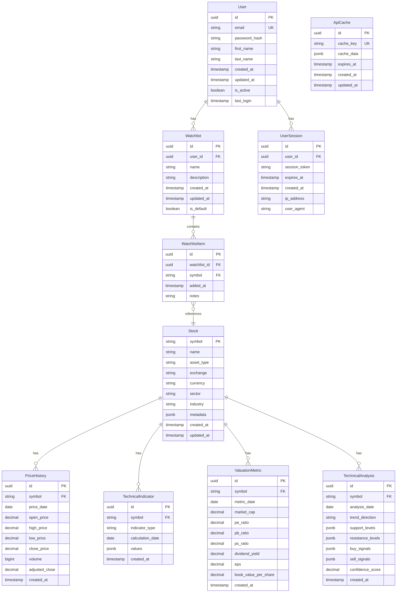

# Data Model: 美股智慧分析儀表板

**建立日期**: 2025-10-15  
**目的**: 定義系統中的實體、關係和驗證規則

## 實體關係圖

## 實體詳細定義

### User (使用者)

**描述**: 系統使用者帳戶信息

**欄位**:
- `id` (UUID, PK): 唯一識別符
- `email` (String, UK): 使用者電子郵件，必須唯一
- `password_hash` (String): 加密後的密碼
- `first_name` (String): 名字
- `last_name` (String): 姓氏
- `created_at` (Timestamp): 帳戶建立時間
- `updated_at` (Timestamp): 最後更新時間
- `is_active` (Boolean): 帳戶是否啟用
- `last_login` (Timestamp): 最後登入時間

**驗證規則**:
- email必須符合有效電子郵件格式
- password_hash必須使用bcrypt加密
- first_name和last_name長度不超過50字符
- is_active默認為true

### Watchlist (觀察清單)

**描述**: 使用者的個人觀察清單

**欄位**:
- `id` (UUID, PK): 唯一識別符
- `user_id` (UUID, FK): 關聯使用者ID
- `name` (String): 觀察清單名稱
- `description` (String, Optional): 觀察清單描述
- `created_at` (Timestamp): 建立時間
- `updated_at` (Timestamp): 最後更新時間
- `is_default` (Boolean): 是否為預設觀察清單

**驗證規則**:
- name長度不超過100字符
- 每個使用者只能有一個預設觀察清單
- description長度不超過500字符

### WatchlistItem (觀察清單項目)

**描述**: 觀察清單中的具體股票項目

**欄位**:
- `id` (UUID, PK): 唯一識別符
- `watchlist_id` (UUID, FK): 關聯觀察清單ID
- `symbol` (String, FK): 關聯股票代碼
- `added_at` (Timestamp): 添加時間
- `notes` (String, Optional): 個人筆記

**驗證規則**:
- 同一觀察清單中不能重複添加相同股票
- symbol必須存在於Stock表中
- notes長度不超過1000字符

### Stock (股票)

**描述**: 股票、指數或加密貨幣的基本信息

**欄位**:
- `symbol` (String, PK): 股票代碼，作為主鍵
- `name` (String): 股票名稱
- `asset_type` (String): 資產類型 (stock, index, cryptocurrency)
- `exchange` (String): 交易所
- `currency` (String): 交易貨幣
- `sector` (String, Optional): 行業分類
- `industry` (String, Optional): 產業分類
- `metadata` (JSONB): 額外元數據
- `created_at` (Timestamp): 建立時間
- `updated_at` (Timestamp): 最後更新時間

**驗證規則**:
- symbol必須大寫且符合交易所格式
- name長度不超過200字符
- asset_type必須為預定義值之一
- currency必須為有效的ISO 4217貨幣代碼

### PriceHistory (價格歷史)

**描述**: 股票的歷史價格數據

**欄位**:
- `id` (UUID, PK): 唯一識別符
- `symbol` (String, FK): 關聯股票代碼
- `price_date` (Date): 價格日期
- `open_price` (Decimal): 開盤價
- `high_price` (Decimal): 最高價
- `low_price` (Decimal): 最低價
- `close_price` (Decimal): 收盤價
- `volume` (BigInt): 成交量
- `adjusted_close` (Decimal): 調整後收盤價
- `created_at` (Timestamp): 建立時間

**驗證規則**:
- symbol必須存在於Stock表中
- 所有價格必須為正數
- high_price必須大於等於low_price
- 同一股票同一天只能有一條記錄
- volume必須為非負整數

### TechnicalIndicator (技術指標)

**描述**: 計算出的技術指標數據

**欄位**:
- `id` (UUID, PK): 唯一識別符
- `symbol` (String, FK): 關聯股票代碼
- `indicator_type` (String): 指標類型 (SMA, RSI, MACD等)
- `calculation_date` (Date): 計算日期
- `values` (JSONB): 指標值
- `created_at` (Timestamp): 建立時間

**驗證規則**:
- symbol必須存在於Stock表中
- indicator_type必須為預定義值之一
- values必須包含指標類型所需的所有欄位
- 同一股票同一指標同一天只能有一條記錄

### ValuationMetric (估值指標)

**描述**: 股票的估值指標數據

**欄位**:
- `id` (UUID, PK): 唯一識別符
- `symbol` (String, FK): 關聯股票代碼
- `metric_date` (Date): 指標日期
- `market_cap` (Decimal, Optional): 市值
- `pe_ratio` (Decimal, Optional): 本益比
- `pb_ratio` (Decimal, Optional): 股價淨值比
- `ps_ratio` (Decimal, Optional): 股價銷售比
- `dividend_yield` (Decimal, Optional): 股息收益率
- `eps` (Decimal, Optional): 每股收益
- `book_value_per_share` (Decimal, Optional): 每股帳面價值
- `created_at` (Timestamp): 建立時間

**驗證規則**:
- symbol必須存在於Stock表中
- 所有比率可以為null（表示數據不可用）
- 非null值必須為正數（除某些特殊指標外）
- 同一股票同一天只能有一條記錄

### TechnicalAnalysis (技術分析)

**描述**: 基於技術指標的分析結果

**欄位**:
- `id` (UUID, PK): 唯一識別符
- `symbol` (String, FK): 關聯股票代碼
- `analysis_date` (Date): 分析日期
- `trend_direction` (String): 趨勢方向 (bullish, bearish, neutral)
- `support_levels` (JSONB): 支撐位
- `resistance_levels` (JSONB): 阻力位
- `buy_signals` (JSONB): 買入信號
- `sell_signals` (JSONB): 賣出信號
- `confidence_score` (Decimal): 信心分數 (0-1)
- `created_at` (Timestamp): 建立時間

**驗證規則**:
- symbol必須存在於Stock表中
- trend_direction必須為預定義值之一
- confidence_score必須在0到1之間
- support_levels和resistance_levels必須為價格數組
- buy_signals和sell_signals必須包含信號類型和強度

### UserSession (使用者會話)

**描述**: 使用者登入會話信息

**欄位**:
- `id` (UUID, PK): 唯一識別符
- `user_id` (UUID, FK): 關聯使用者ID
- `session_token` (String): 會話令牌
- `expires_at` (Timestamp): 過期時間
- `created_at` (Timestamp): 建立時間
- `ip_address` (String): IP地址
- `user_agent` (String): 使用者代理

**驗證規則**:
- session_token必須唯一
- expires_at必須晚於created_at
- ip_address必須符合有效IP格式
- user_agent長度不超過500字符

### ApiCache (API緩存)

**描述**: 存儲API響應的緩存數據

**欄位**:
- `id` (UUID, PK): 唯一識別符
- `cache_key` (String, UK): 緩存鍵，必須唯一
- `cache_data` (JSONB): 緩存的數據
- `expires_at` (Timestamp): 過期時間
- `created_at` (Timestamp): 建立時間
- `updated_at` (Timestamp): 最後更新時間

**驗證規則**:
- cache_key長度不超過255字符
- expires_at必須晚於created_at
- cache_data不能為空

## 索引策略

### 主要索引
- `user.email`: 唯一索引，支持登入查詢
- `stock.symbol`: 主鍵索引，支持股票查詢
- `price_history.symbol + price_history.price_date`: 複合索引，支持歷史價格查詢
- `watchlist.user_id`: 支持使用者觀察清單查詢
- `watchlist_item.watchlist_id`: 支持觀察清單項目查詢

### 次要索引
- `technical_indicator.symbol + technical_indicator.indicator_type + technical_indicator.calculation_date`: 支持技術指標查詢
- `valuation_metric.symbol + valuation_metric.metric_date`: 支持估值指標查詢
- `user_session.session_token`: 支持會話驗證
- `user_session.user_id + user_session.expires_at`: 支持會話清理
- `api_cache.cache_key`: 支持緩存查詢
- `api_cache.expires_at`: 支持過期緩存清理

## 數據遷移策略

### 初始數據
- 預載入主要市場指數 (道瓊、納斯達克、S&P 500)
- 預載入主要加密貨幣 (Bitcoin、Ethereum)
- 創建系統管理員帳戶

### 數據更新策略
- 價格歷史數據每日更新
- 技術指標計算基於最新的價格數據
- 估值指標每週更新
- 技術分析每日重新計算

## 數據保留策略

- 價格歷史數據永久保留
- 技術指標保留最近2年
- 估值指標保留最近5年
- 技術分析保留最近1年
- 過期會話數據自動清理

## 數據一致性保證

### 事務邊界
- 使用者註冊/登入操作
- 觀察清單添加/刪除操作
- 價格數據批量更新

### 並發控制
- 使用樂觀鎖定處理觀察清單更新
- 使用數據庫事務確保價格數據一致性
- 實施適當的重試機制處理並發更新

這個數據模型設計使用symbol作為外鍵，簡化了查詢並提高了性能，特別適合金融數據應用場景。它支持美股智慧分析儀表板的所有核心功能，包括股票查詢、歷史數據分析、技術指標計算、估值分析和個人化觀察清單管理。